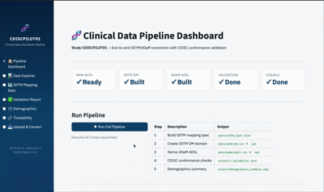

# Clinical Study Reports and Submission Demo - py

**Python-Based SDTM/ADaM Pipeline Demo**

---

## Why Python for Clinical Programming?

Python is opensouce and has a large community, which makes it a great choice for clinical programming and complement SAS.. 

| Criterion | Python Advantage |
|-----------|-----------------|
| **Reproducibility** | `requirements.txt` + virtual environments pin exact dependency versions; anyone can reproduce the pipeline identically |
| **Open Source** | Zero licensing friction for collaborators, CROs, and regulatory reviewers |
| **Speed** | Pandas vectorized operations match or exceed SAS DATA step performance on datasets up to ~10M rows |
| **Ecosystem** | First-class ML/NLP libraries (for signal detection, eCOA analysis) sit alongside CDISC tooling |
| **Validation** | Programmatic conformance checks integrate directly into CI/CD; no manual log review |
| **Interoperability** | `pyreadstat` reads/writes SAS `.xpt` and `.sas7bdat` natively — SAS teams can consume output unchanged |

Python complements a SAS-heavy environment by handling automation, validation orchestration, and metadata generation while SAS remains the submission-ready language where required by SOPs.

---

## Project Structure

```
clinical-demo-py/
├── app.py                     # Streamlit interactive dashboard
├── run_pipeline.py            # Master pipeline (single command)
├── requirements.txt
├── .streamlit/
│   └── config.toml            # Dashboard theme configuration
├── data/
│   ├── raw/                   # Simulated EDC exports
│   │   ├── enrollment.csv     # Demographics + randomization
│   │   ├── disposition.csv    # Subject completion/discontinuation
│   │   └── vitals.csv         # Vital signs (screening, baseline, post-baseline)
│   ├── sdtm/                  # Output: SDTM datasets (.csv + .xpt)
│   └── adam/                  # Output: ADaM datasets (.csv + .xpt)
├── specs/
│   └── sdtm_spec.xlsx         # Source-to-Target mapping specification
├── scripts/
│   ├── build_spec.py          # Generate mapping specification
│   ├── create_dm.py           # SDTM DM domain
│   ├── create_adsl.py         # ADaM ADSL dataset
│   ├── validate_core.py       # CDISC conformance checks
│   └── demographics_summary.py # Table 14.1.1 + figure
├── utils/
│   └── cdash_utils.py         # Reusable transformation functions
├── output/                    # Reports, figures, validation JSON
└── docs/                      # Traceability documentation
```

---

## Quick Start

```bash
# 1. Clone and install
git clone https://github.com/prabinrs/CSRs.git 
cd CSRs
pip install -r requirements.txt

# 2. Run the full pipeline (CLI)
python run_pipeline.py

# 3. Launch the interactive dashboard
streamlit run app.py
```

### Command-Line Pipeline

`run_pipeline.py` executes five steps sequentially:

1. **Build Spec** → `specs/sdtm_spec.xlsx`
2. **SDTM DM** → `data/sdtm/dm.csv` + `dm.xpt`
3. **ADaM ADSL** → `data/adam/adsl.csv` + `adsl.xpt`
4. **Validation** → `output/dm_validation.json` + `output/adsl_validation.json`
5. **Visualization** → `output/demographics_summary.png` + `output/table_14_1_1.txt`

### Interactive Dashboard (Streamlit)

`streamlit run app.py` launches a browser-based dashboard with seven sections:

| Section | Who It Helps | What It Does |
|---------|-------------|-------------|
| **Pipeline Dashboard** | Programmers, Leads | One-click pipeline execution with progress tracking and output inventory |
| **Data Explorer** | Biostatisticians, Medical Writers | Browse/filter Raw, SDTM, and ADaM datasets with CSV download |
| **SDTM Mapping Spec** | Data Standards Leads | Interactive source-to-target specification with type/source filtering |
| **Validation Report** | QA, Compliance | CDISC conformance gauges, finding tables, and live re-validation |
| **Demographics** | Biostatisticians, Clinical Teams | Interactive Plotly charts (age, sex, race, duration, completion) with population toggles |
| **Traceability** | Regulatory, Submission Teams | Searchable ADaM→SDTM trace table with per-variable deep-dive and sample data |
| **Upload & Convert** | CROs, Partner Sites | Upload custom enrollment CSVs and get back validated SDTM DM instantly |

The dashboard requires no SAS installation, runs in any browser, and can be deployed via Streamlit Community Cloud, Docker, or internal infrastructure.

---

## Traceability: Raw → SDTM → ADaM

Full traceability from raw CRF fields through SDTM to ADaM is a core requirement for regulatory submission. Below is the trace path for key variables:

### Date Conversion Example

```
Raw (enrollment.csv)          SDTM DM                      ADaM ADSL
─────────────────────         ──────────────                ─────────────
BRTHDT = "1958-07-22"    →    BRTHDTC = "1958-07-22"   →   (used in AGE derivation)
RFSTDTC = "2023-03-16"   →    RFSTDTC = "2023-03-16"   →   TRTSDT = "2023-03-16"
RFENDTC = "2023-09-14"   →    RFENDTC = "2023-09-14"   →   TRTEDT = "2023-09-14"
                                                             TRTDURD = 183 days
```

### Age Derivation Trace

```
BRTHDTC = "1958-07-22"
RFSTDTC = "2023-03-16"
AGE = floor((2023-03-16 − 1958-07-22) / 365.25) = 64 years
AGEGR1 = "<65"
AGEGR1N = 1
```

### Population Flag Logic

| Flag | Definition | SDTM Source | Rule |
|------|-----------|-------------|------|
| SAFFL | Safety Population | DM.RFSTDTC | Y if received ≥1 dose (RFSTDTC not null) |
| ITTFL | Intent-to-Treat | DM.ARM | Y if randomized (ARM not null) |
| COMPLFL | Completers | DS.DSDECOD | Y if DSDECOD = "COMPLETED" |

---

## Validation Approach

`validate_core.py` implements 11 programmatic checks across two domains:

**SDTM DM checks:**
- SD0001: Required variables present
- SD0002: No duplicate USUBJIDs
- SD0003: Key identifiers non-null
- CT0001: Controlled terminology compliance (SEX, RACE, ETHNIC, AGEU)
- DT0001: ISO 8601 date format conformance
- DM0001: AGE consistent with BRTHDTC/RFSTDTC derivation

**ADaM ADSL checks:**
- SD0001–SD0003: Structural checks
- CT0001: Controlled terminology
- AD0001: Population flag values (Y/N only)
- AD0002: Treatment variable mapping consistency (TRT01P → TRT01PN)
- AD0003: Treatment duration derivation (TRTDURD = TRTEDT − TRTSDT + 1)

In a production environment, these would be supplemented by the CDISC Open Rules Engine (CORE) for comprehensive validation against the full rule catalog.

---

## Data Sources

This demo uses simulated data modeled after the **CDISC Pilot Project** (Study CDISCPILOT01), a widely-used reference dataset in the clinical programming community. No real patient data is included.

---

## License

Demo project for professional portfolio purposes.
